

🍂 Novembre 2025 🍂

Notre quotidien du mois de novembre ❤️

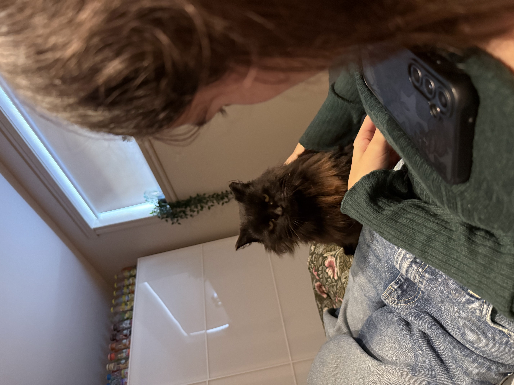

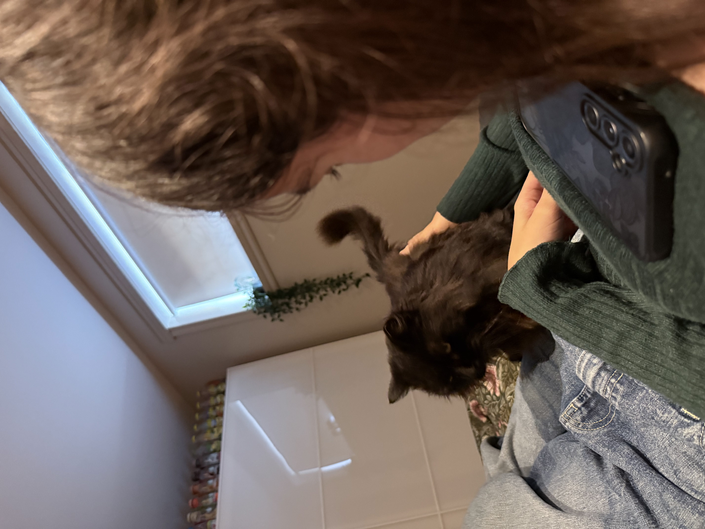

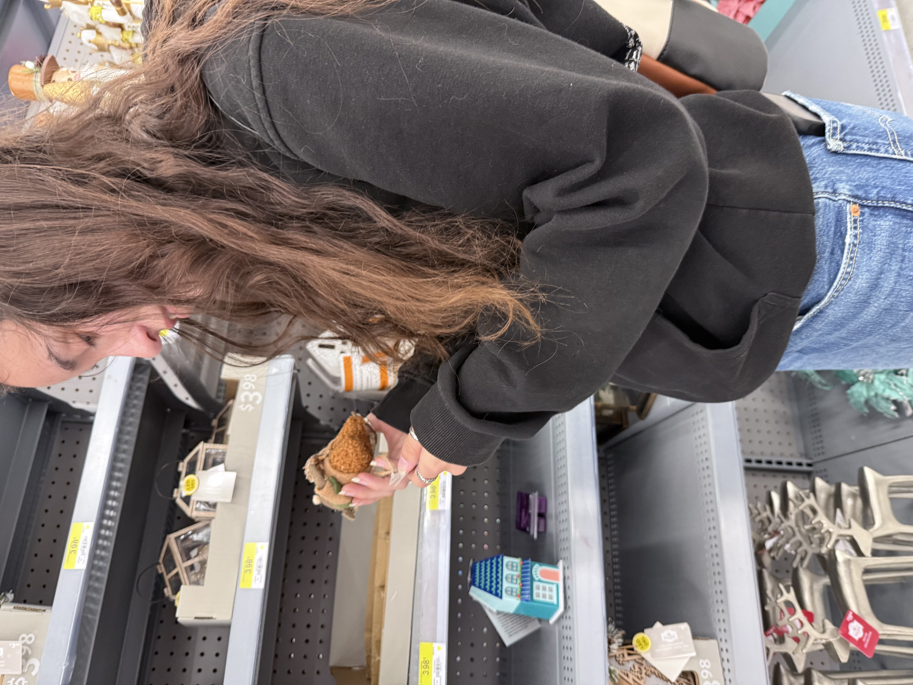

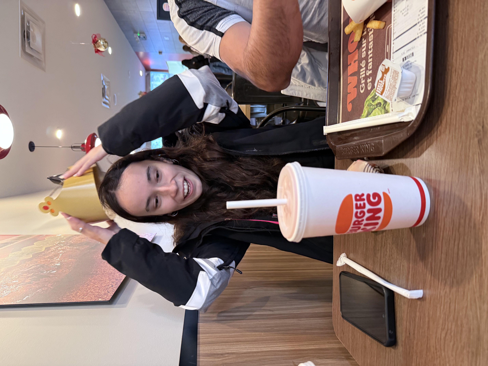

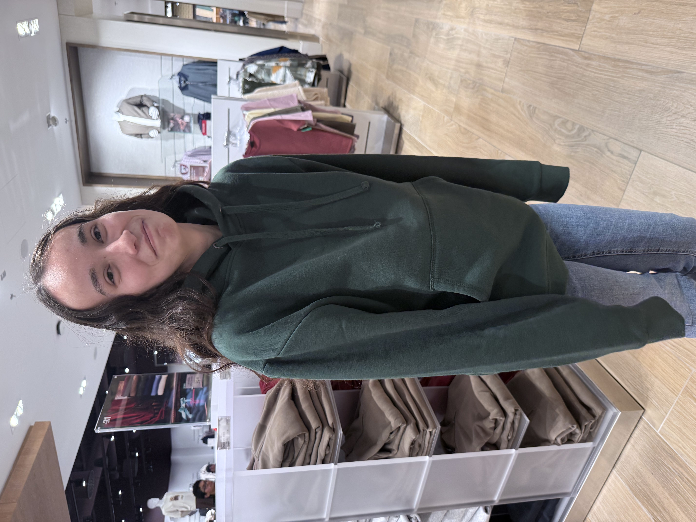

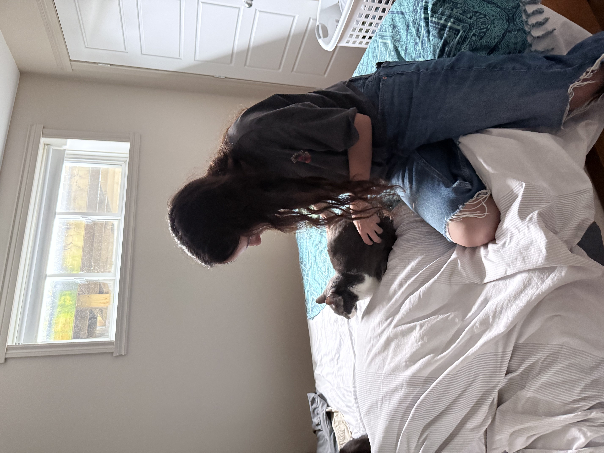

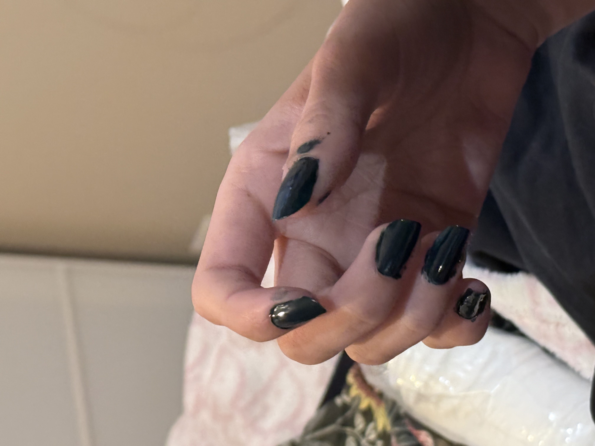

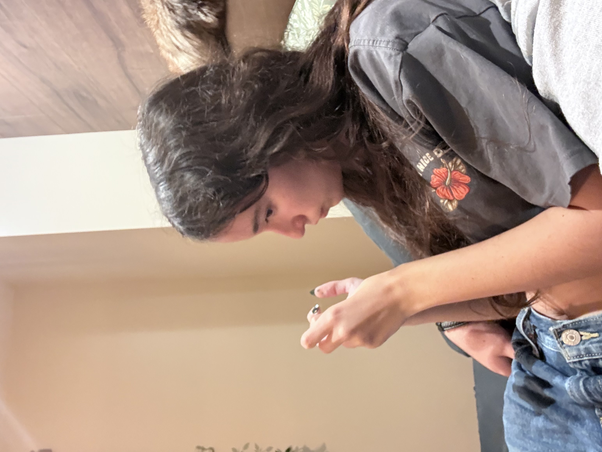

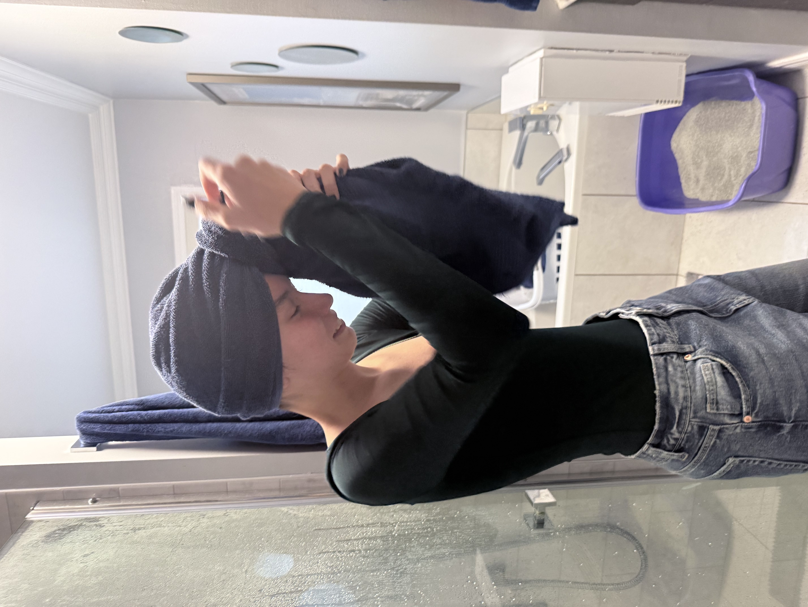

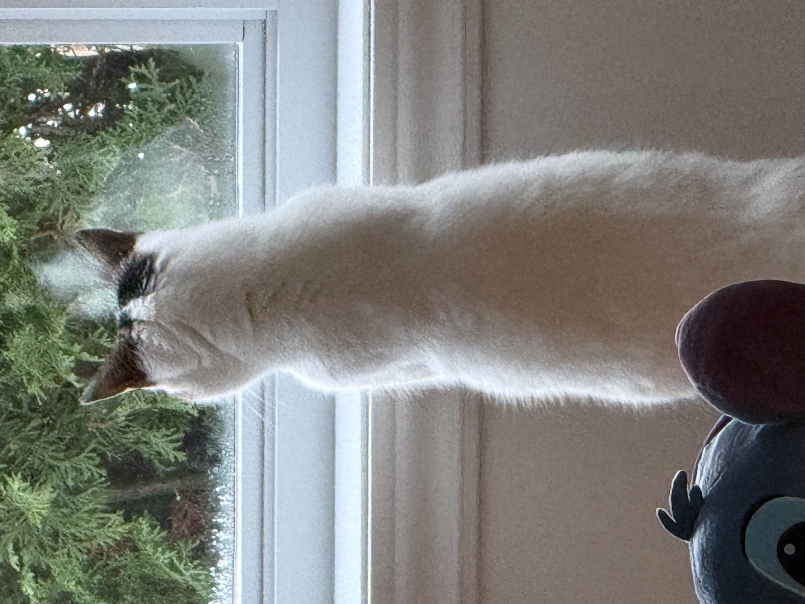

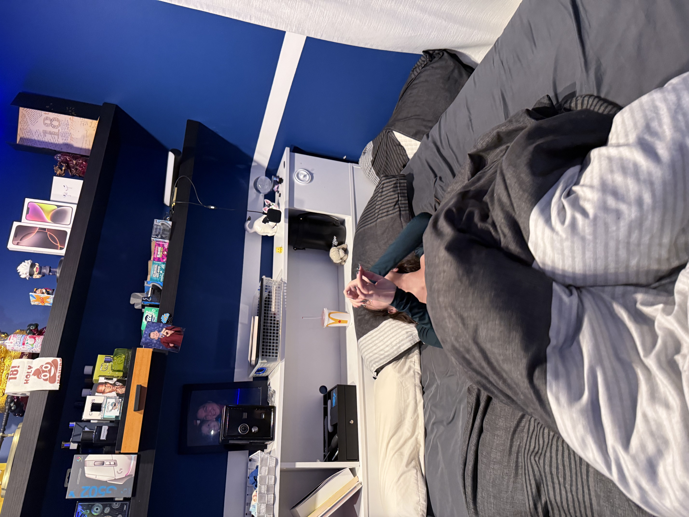

<iframe width="100%" height="700"
src="https://www.youtube.com/embed/azFJ6Ewo2Sk"
frameborder="0" allowfullscreen></iframe>

